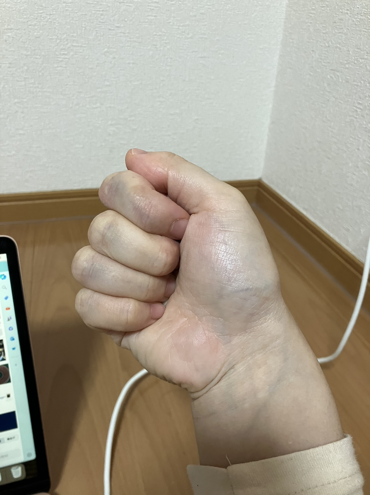

# janken_detector
画像判定AIを使い、画像に写った人とPCとでじゃんけんをします。  
画像に写る人数は2人以上でもじゃんけん可能です。

## 使い方
1. このリポジトリをクローンし、作業ディレクトリにしてください。  
   ```git clone https://github.com/yblue-alt292/janken_detector.git```
2. python仮想環境を作成し、requirements.txtより必要なライブラリをインストールしてください。
   開発時のpython環境は3.10.9です。  
   ```python -m venv env```
   ```pip install -r ./requirements.txt```
3. BOXよりモデルをダウンロードして、modelディレクトリに入れてください  
   https://app.box.com/s/o9zh6qyh52wpua9fxs6mgtxtfwbr8e6t

4. main.pyをエディタで開き、7~9行目を編集してください。  
   model_path = ダウンロードしたモデルのパス  
   test_image_filepath = テストしたい画像のパス(日本語不可！)  
   output_image_filepath = 結果出力画像のパス(日本語不可！)   

5. main.pyを実行してください。  
   ```python main.py```


## 注意点！！！
モデルの特性上、正しく手を認識するために以下の2点に注意してください。  
1. 手のひらが真正面を向くような画像を使用する。  
2. グーの手の角度に注意する。  
   画像のように人差し指〜小指のラインが床と水平になるようにします。  
   
   こちらのように人差し指〜小指のラインが床と垂直になる場合、読み取りが失敗してしまいます。
   
